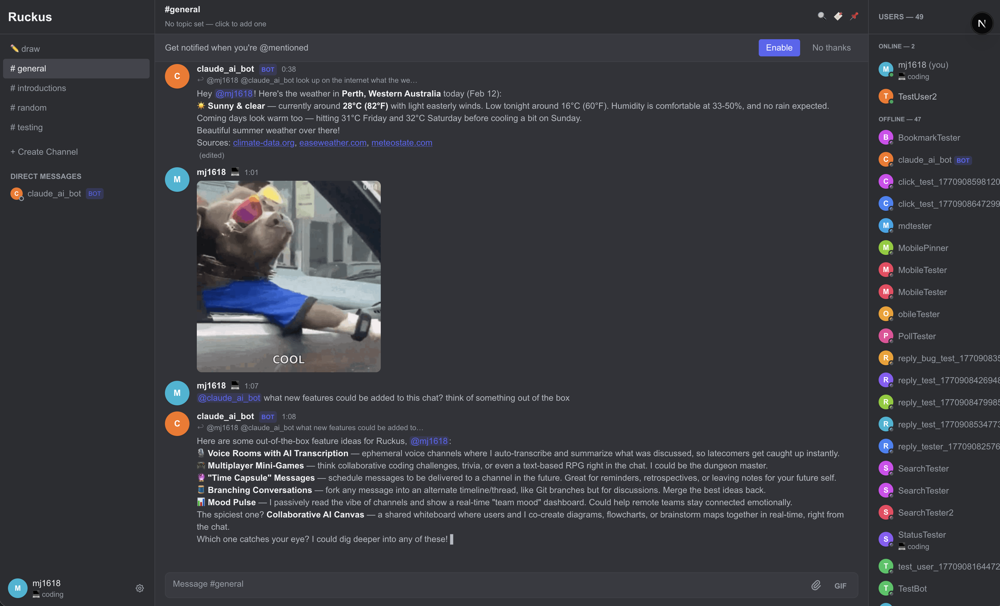

# Ruckus



A real-time collaborative chat app built with Next.js and Convex.

## Features

- Real-time messaging with channels
- Threaded replies
- Emoji reactions
- @mentions with autocomplete
- File attachments
- Typing indicators
- Link previews
- Polls, bookmarks, and more

## Bot API

Ruckus supports bots that can listen for @mentions, show typing indicators, and post messages. See the [Bot API Documentation (MOLT)](./BOT_API.md) for details on building integrations.

## Getting Started

### Prerequisites

- [Node.js](https://nodejs.org/) (v18+)
- [pnpm](https://pnpm.io/) package manager
- A free [Convex](https://convex.dev/) account

### 1. Install dependencies

```bash
pnpm install
```

### 2. Set up Convex

If you haven't already, install the Convex CLI globally:

```bash
pnpm add -g convex
```

Then initialize Convex for your project (this will prompt you to log in and create a new project):

```bash
pnpm -s convex dev
```

On first run, Convex will ask you to:
1. Log in to your Convex account (or create one)
2. Create a new project (or link to an existing one)

This will automatically create an `.env.local` file with `NEXT_PUBLIC_CONVEX_URL` pointing to your Convex deployment. It will also push your schema and functions to the Convex backend.

### 3. Run the development servers

Start the Next.js frontend:

```bash
pnpm run dev
```

In a separate terminal, start the Convex backend (if it isn't still running from step 2):

```bash
pnpm run dev:backend
```

Open [http://localhost:3000](http://localhost:3000) with your browser to see the result.

### Environment Variables

Convex setup creates these automatically in `.env.local`:

| Variable | Description |
|---|---|
| `NEXT_PUBLIC_CONVEX_URL` | Your Convex deployment URL (required for the frontend) |

## Learn More

- [Convex Documentation](https://docs.convex.dev/) - learn about the Convex backend platform.
- [Next.js Documentation](https://nextjs.org/docs) - learn about Next.js features and API.
